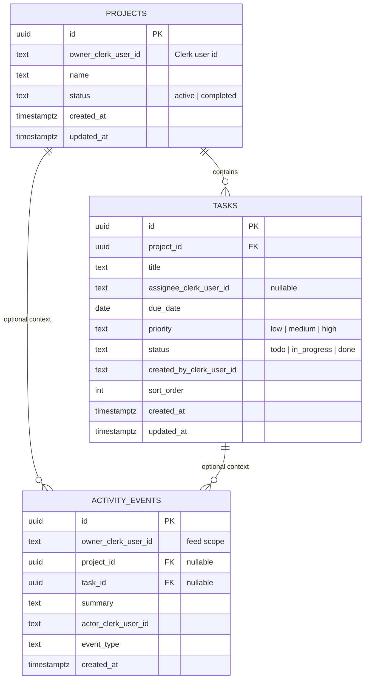

# SharkDesk — data & backend architecture

This document describes how the UI maps to persistence and how Clerk fits in **without** duplicating authentication in the database.

## Product surface (from the codebase)

| Area | Route(s) | Domain concepts |
|------|-----------|-----------------|
| Projects | `/`, `/projects`, `/projects/[id]` | Projects with status (Active / Completed); tasks under a project |
| My Work | `/my-work` | Tasks assigned to the current user, grouped by project |
| Activity | `/activity` | Chronological feed of workspace changes |

UI enums today (mapped in app layer to DB values):

- Project status: `Active` / `Completed` → stored as `active` / `completed`
- Task priority: Low / Medium / High → `low` / `medium` / `high`
- Task status: Todo / In Progress / Done → `todo` / `in_progress` / `done`

## Identity model (Clerk only)

- **No** `auth.users`, passwords, or sessions in Postgres.
- Foreign references to people use **`text` columns** storing the **Clerk user id** (same value JWT `sub` must carry when using Supabase with Clerk).
- Display names and avatars continue to come from **Clerk** on the client or via Clerk Backend API.

Configure Supabase to accept Clerk-issued JWTs so `auth.jwt()->>'sub'` matches `owner_clerk_user_id`, `assignee_clerk_user_id`, etc. See [Supabase + Clerk](https://supabase.com/docs/guides/auth/third-party/clerk).

## Entity diagram

## Access patterns

1. **Projects list / detail** — Query `projects` filtered by `owner_clerk_user_id = current user`.
2. **Project tasks** — Query `tasks` where `project_id = …`; enforce project ownership or membership via RLS.
3. **My Work** — Query `tasks` where `assignee_clerk_user_id = current user` (join `projects` for names).
4. **Activity** — Query `activity_events` where `owner_clerk_user_id = current user`, ordered by `created_at` descending.

## Row Level Security (RLS)

The migration enables RLS and uses `public.clerk_sub()` (`auth.jwt()->>'sub'`). Until Clerk JWT is wired into Supabase, use the **service role** key only from trusted server code, or relax policies in development.

## Files

- SQL migration: `supabase/migrations/20250510120000_initial_schema.sql`

Apply locally with Supabase CLI (`supabase db push` / `supabase migration up`) or run the SQL in the Supabase SQL editor.
